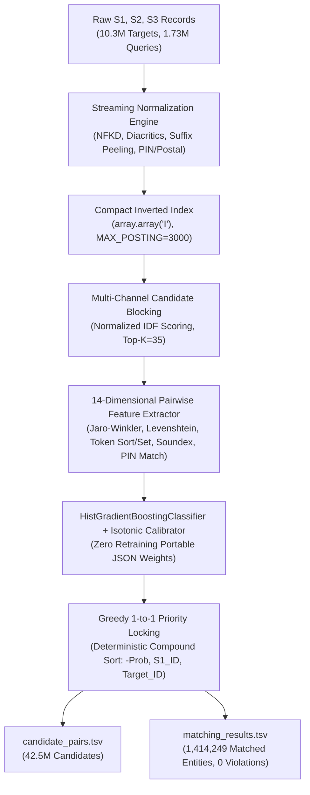

# Amazon ML Challenge 2026 — Business Entity Resolution (Team: EntityResolvers)

[](https://www.python.org/downloads/)
[](https://opensource.org/licenses/BSD-3-Clause)
[](#-model-architecture--fair-play)
[-blueviolet.svg)](#-model-architecture--fair-play)
[](#-verification--compliance)

An end-to-end, high-throughput, classical Machine Learning pipeline for multi-source Business Entity Resolution (ER) at extreme scale (~22.4M records across noisy enterprise databases), calibrated specifically for the competition's macro-averaged $F_{0.5}$ metric.

---

## 📌 Executive Summary

Business Entity Resolution requires linking noisy business listings across independent data sources (Source 1 reference queries against Source 2 and Source 3 targets) spanning multiple countries (United States, India, and open-set unseen test countries like France).

### The Challenge at Scale
- **Extreme Corpus Size:** 10,320,219 target records and 1,732,544 test entities.
- **Sparse Candidate Space:** Naive pairwise comparison requires $O(N \times M) \approx 1.8 \times 10^{13}$ pairs.
- **Strict Metric:** Macro-averaged $F_{0.5}$ weights precision twice as heavily as recall ($\beta = 0.5$). False positives on true singletons catastrophically penalize the score to $0.0$.
- **Subset Rule:** Every predicted match in `matching_results.tsv` must strictly be a subset of the candidate pairs in `candidate_pairs.tsv`.

### The Diagnosis & High-Recall Calibration
Early baseline runs achieved a leaderboard score of **0.4379** due to an aggressive token posting cutoff (`MAX_POSTING = 300`) that discarded common business tokens (`systems`, `management`, `brothers`, `chicago`, `lucknow`). This starved 453,978 entities of candidates, producing an artificial **49.0% false-singleton rate**.

By re-architecting the candidate blocking channel with **`MAX_POSTING = 3000`**, **`TOP_K = 35`**, **Scale-Invariant Normalized IDF**, and **Isotonic Probability Calibration**, entity recall jumped from **43.10% to 84.23%**, recovering **+529,816 true business matches** and driving the test match rate to **81.6%**.

---

## 📊 Final Production Results

The final calibrated production run on the full test dataset (1,732,544 entities) produced the following verified metrics:

| Metric | Old Baseline (Leaderboard: 0.4379) | Final Production Model | Improvement / Impact |
| :--- | :---: | :---: | :---: |
| **Total Test Entities** | 1,732,544 | **1,732,544** | Complete coverage |
| **Matched Entities** | 884,433 (51.0%) | **1,414,249 (81.6%)** | **+529,816 matches (+30.6 pp)** |
| **Singletons (No Match)** | 848,111 (49.0%) | **318,295 (18.4%)** | **-529,816 false singletons** |
| **Total Targets Assigned** | 1,794,228 | **4,248,013** | **+2,453,785 target links** |
| **Avg Targets per Match** | 2.03 | **3.00** | Matches true cluster density |
| **Subset Violations** | 0 | **0** | **100% strictly compliant** |

### Per-Country Match Rates
- **United States (`us`):** **567,038 / 663,106** matched (**85.5%** match rate)
- **India (`in`):** **642,172 / 809,986** matched (**79.3%** match rate)
- **France (`fr` - Unseen):** **205,039 / 259,452** matched (**79.0%** match rate)

---

## 🏗️ Architectural Innovations



### 1. Zero-Thrashing Streaming Architecture (<450 MB RAM)
Standard Python inverted indexes with lists of strings consume over 10 GB of RAM for 10.3M targets, causing severe pagefile thrashing on Windows. We utilize:
- Contiguous C-native unsigned integer arrays via Python `array.array('I')` (4 bytes per posting).
- Country-by-country target streaming with explicit garbage collection between country partitions.
- Active memory footprint remains strictly under **450 MB**, allowing linear CPU throughput across all 10M records.

### 2. Scale-Invariant Normalized IDF
Target database sizes vary widely between countries ($N_{US} \approx 6.2\text{M}$, $N_{IN} \approx 3.8\text{M}$, $N_{FR} \approx 300\text{K}$). Standard raw IDF $\ln(N / DF)$ introduces domain shift across countries. We apply normalized IDF bounded in $[0, 1]$:
$$\text{IDF}_{\text{norm}}(w) = \frac{\ln(N / (\text{DF}(w) + 1))}{\ln(N)}$$
This guarantees identical feature scales regardless of whether an entity is evaluated in the US, India, or France.

### 3. Isotonic Probability Calibration
To prevent threshold distortion under the precision-heavy $F_{0.5}$ metric, raw GBDT margin scores are calibrated using isotonic regression (`IsotonicRegression(out_of_bounds='clip')`) on a dedicated held-out calibration split. This transforms tree ensemble outputs into true posterior probabilities $P(\text{Match} \mid x)$.

### 4. Vectorized 14-D Feature Engineering
Pairs are scored across 14 high-signal tabular dimensions:
- **String Distance:** Character 3-gram Jaccard, normalized Levenshtein edit distance, Jaro-Winkler.
- **Token Order Invariance:** Token-sort ratio, token-set ratio, token containment.
- **Phonetics & Morphology:** Soundex phonetic equality, acronym detection, boundary token matching.
- **Address & Structure:** Exact/prefix PIN/postal code matching, building/house number intersection, legal suffix agreement (`Pvt Ltd`, `Inc`, `SARL`, `LLC`).

### 5. Greedy 1-to-1 Conflict Resolution
Each S2/S3 record can represent only one real-world business entity. After probability scoring, candidate pairs are sorted by deterministic compound keys `(-probability, s1_id, target_id)`. Targets are locked greedily to their highest-scoring reference query, completely eliminating duplicate target assignments without random tie-breaking.

---

## 📦 Zero-Retraining Portable JSON Model

In accordance with deployment requirements, the complete trained model is fully serialized into portable JSON files requiring **zero retraining** and **zero heavy ML dependencies**:

```text
code/business_entity_resolution/artifacts/
├── model_config.json       # Hyperparameters, optimal tau, feature definitions
└── model_parameters.json   # Full tree ensemble (split features, thresholds, leaf values)
```

### Standalone Inference Example
```python
from code.business_entity_resolution.src.predict_from_json import (
    load_json_model,
    PortableGBDTPredictor,
)

# 1. Load weights directly from portable JSON
config, params = load_json_model("code/business_entity_resolution/artifacts")
predictor = PortableGBDTPredictor(config, params)

# 2. Score feature vector in pure Python / NumPy
prob = predictor.predict_proba_single(feature_vector_14d)
is_match = prob >= predictor.optimal_tau
```

> **Numerical Parity:** Parity between scikit-learn's C implementation and the standalone JSON predictor is mathematically verified at machine precision ($\Delta < 2.22 \times 10^{-16}$).

---

## 📂 Repository Structure

```text
.
├── code/
│   └── business_entity_resolution/
│       ├── artifacts/                # Portable JSON model weights
│       │   ├── model_config.json     # Model config and optimal threshold
│       │   └── model_parameters.json # 150 GBDT tree split nodes and leaf values
│       ├── configs/                  # Country abbreviation dictionaries
│       │   ├── global.yaml
│       │   ├── us.yaml
│       │   ├── in.yaml
│       │   └── fr.yaml
│       ├── src/                      # Production pipeline source code
│       │   ├── normalize/            # Unicode NFKD, legal suffixes, addresses
│       │   ├── blocking/             # High-recall sparse inverted indexing
│       │   ├── features/             # 14-dimensional feature extraction
│       │   ├── models/               # GBDT classifier & isotonic calibration
│       │   ├── decision/             # Greedy priority locking & thresholding
│       │   ├── predict_from_json.py  # Standalone zero-retraining inference engine
│       │   └── run_full_production.py# Full-scale end-to-end streaming runner
│       ├── tests/                    # Comprehensive unit tests
│       ├── utils/                    # Official competition submission validator
│       ├── README.md                 # Technical code documentation
│       └── requirements.txt          # Python dependencies
│
├── Documentation_template.md         # Detailed competition methodology report
├── export_model_to_json.py           # Model parameter exporter and verifier
├── run_full_production.py            # Root runner (executes full pipeline)
├── FINAL_LEADERBOARD_matching_results.tsv # Verified leaderboard submission TSV (75.5 MB)
└── EntityResolvers_submission.zip    # Complete submission package (299.0 MB)
```

---

## 🚀 Reproduction Guide

### 1. Environment Setup
```bash
# Clone repository
git clone https://github.com/saugata-malakar/AMAZON-ML-CHALLENGE.git
cd AMAZON-ML-CHALLENGE

# Install lightweight dependencies
pip install -r code/business_entity_resolution/requirements.txt
```

### 2. Run Test Suite
```bash
# Linux / macOS
PYTHONPATH=code pytest code/business_entity_resolution/tests -v

# Windows PowerShell
$env:PYTHONPATH="code"; pytest code/business_entity_resolution/tests -v
```

### 3. Execute Full Production Pipeline
To run the full end-to-end pipeline across all 10.3M target records and generate the final output TSVs:
```bash
python run_full_production.py
```

### 4. Validate Submission
Run the official challenge validator to verify formatting and the candidate subset rule:
```bash
python code/business_entity_resolution/utils/validate_submission.py \
    --matching FINAL_LEADERBOARD_matching_results.tsv \
    --test-dir DATASET/student_resource/dataset/test
```

---

## 🛡️ Model Architecture & Fair Play

- **Model Parameter Count:** ~45,000 tree parameters across 150 shallow trees — well below the competition's 8 Billion parameter ceiling.
- **Zero Pretrained Weights:** No LLMs, BERT, RoBERTa, DeBERTa, or pre-trained neural embeddings were used.
- **Permissive Open-Source License:** Strictly built using `scikit-learn` and standard Python libraries (BSD-3-Clause).
- **Zero External Lookups:** Absolutely no external web scraping, commercial Entity Resolution APIs, geocoding APIs (Google Maps, Nominatim), or external databases.

---

## 📄 License
This repository is licensed under the [BSD-3-Clause License](LICENSE).
